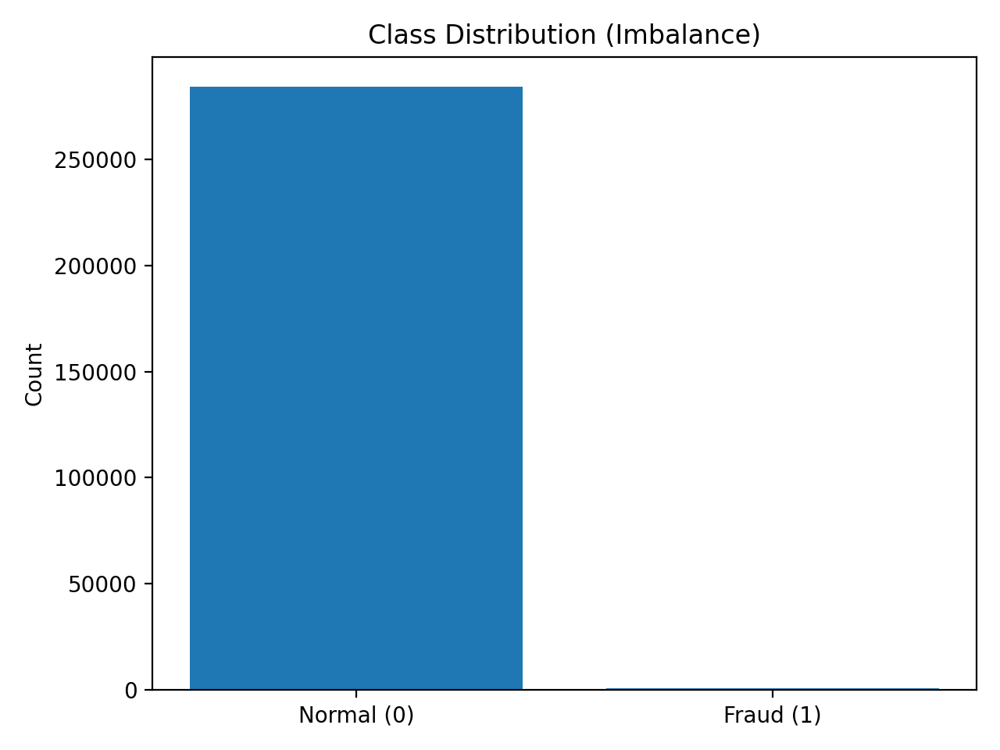
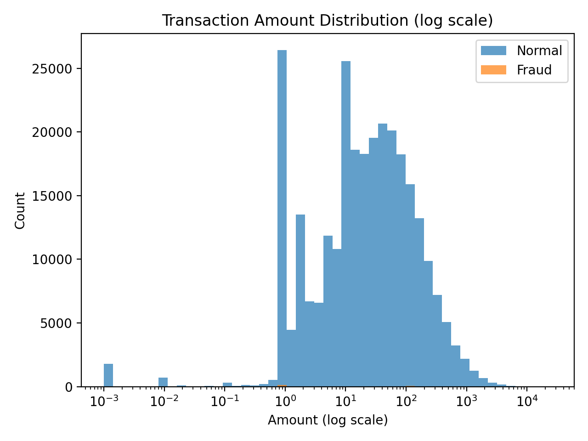
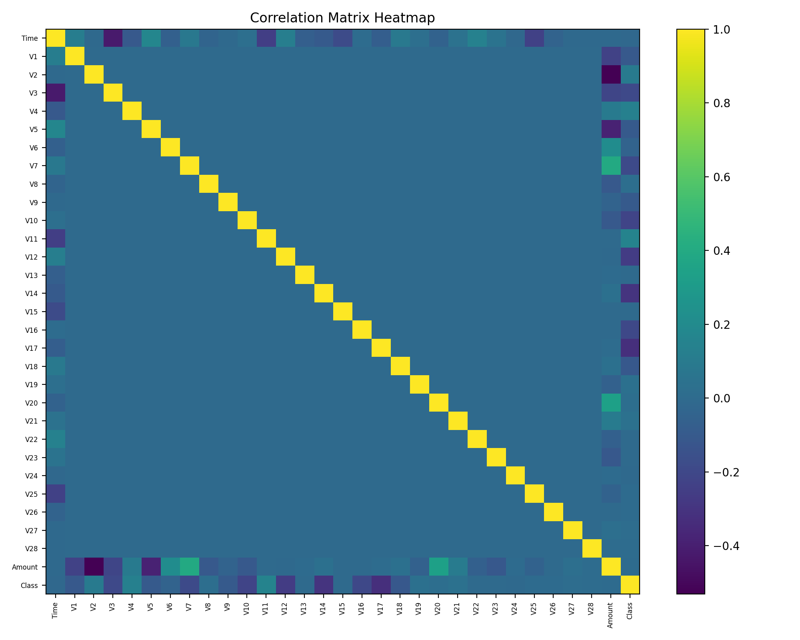
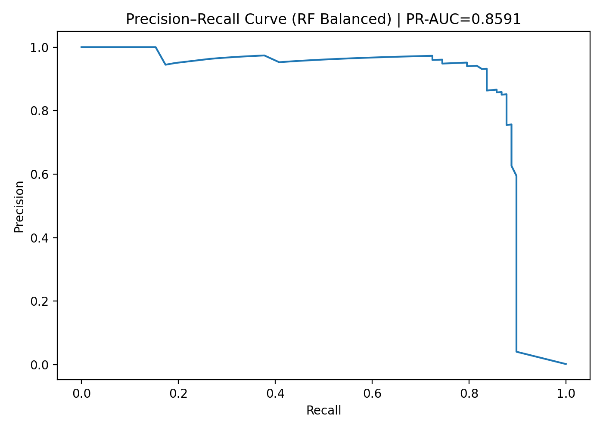
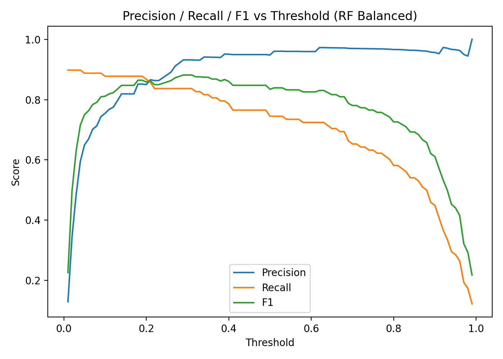
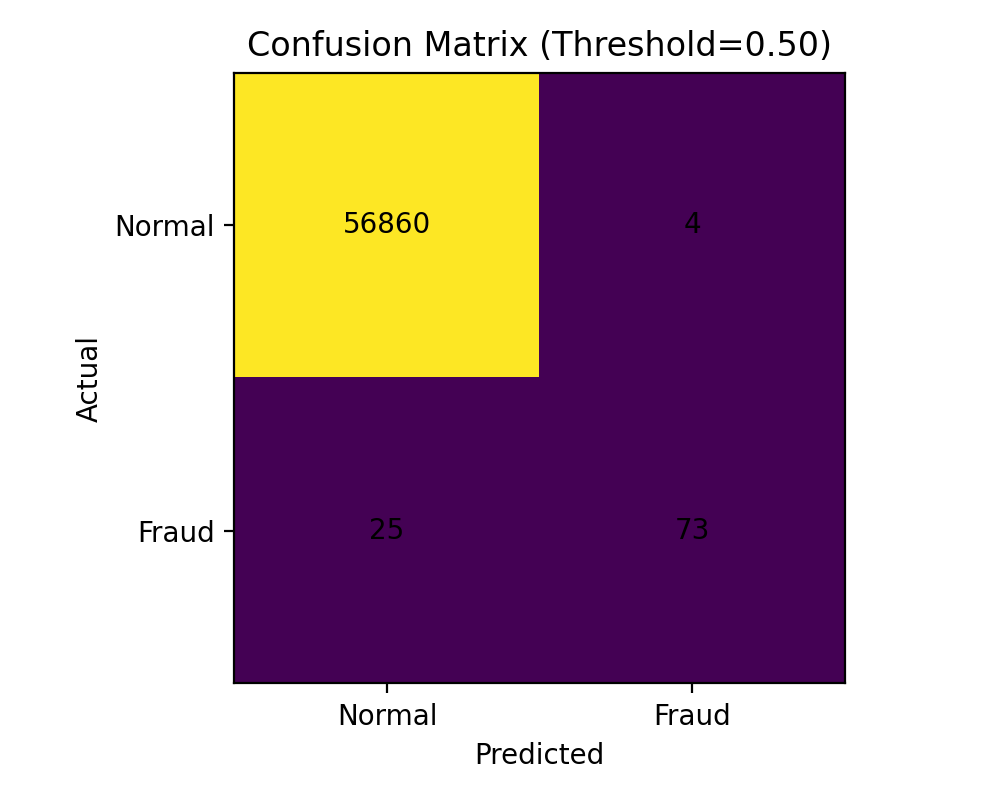
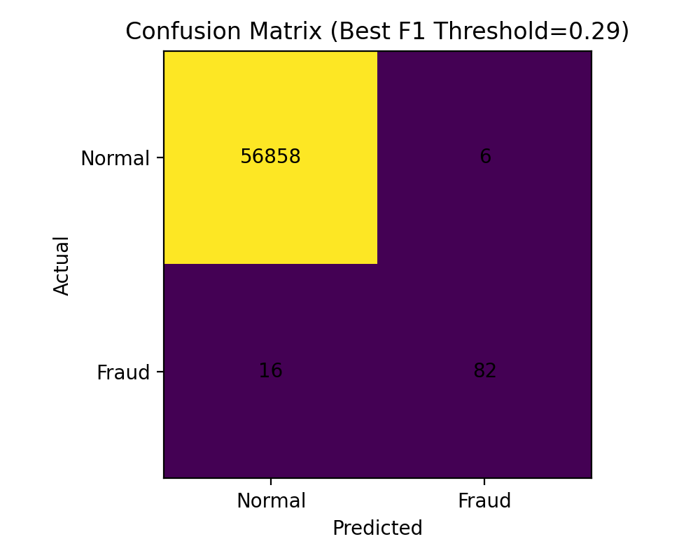
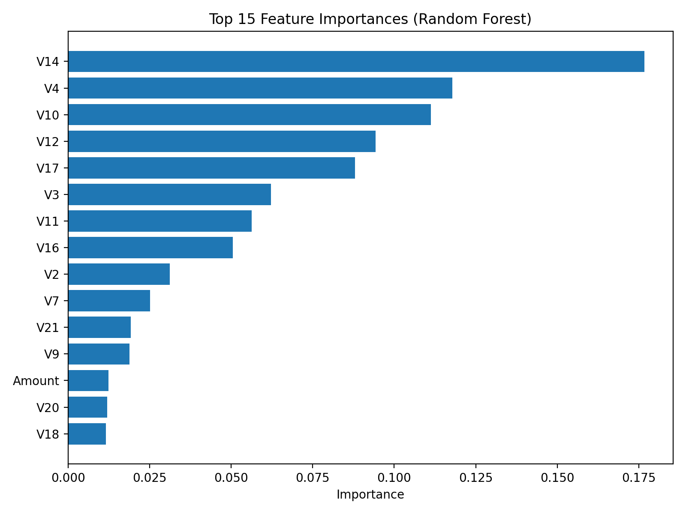

# 💳 Credit Card Fraud Detection (Machine Learning)

A machine learning project to detect **fraudulent credit card transactions** using highly imbalanced historical data (fraud ≈ 0.17%).  
Built as an **end-to-end, interview-ready ML pipeline**: baseline → threshold tuning → model comparison → EDA → reporting & explainability.

---

## 🚀 Highlights

- ✅ Handles **extreme class imbalance**
- ✅ Uses **Precision–Recall** (better than accuracy for fraud)
- ✅ Threshold tuning (not assuming 0.5)
- ✅ Model comparison: Logistic Regression vs Random Forest (+ undersampling)
- ✅ EDA + plots + final reporting outputs

---

## 📂 Project Structure

```text
credit-card-fraud-detection/
  src/
    config.py
    data_loader.py
    train_baseline.py
    threshold_tuning.py
    train_models.py
    eda_report.py
    reporting.py
  reports/
    figures/
      class_distribution.png
      amount_distribution_log.png
      correlation_heatmap.png
      pr_curve_rf_balanced.png
      threshold_tradeoff_rf_balanced.png
      confusion_matrix_thr_0_50.png
      confusion_matrix_best_f1.png
  requirements.txt
  README.md
```
---

## 📊 Key Results (Random Forest - Balanced)

Uses PR-AUC as primary metric

Generates:

PR curve

Threshold tradeoff plot

Confusion matrices

--- 

*Plots*
Class Distribution


Amount Distribution (Log Scale)


Correlation Heatmap


Precision–Recall Curve (RF Balanced)


Threshold Tradeoff


Confusion Matrix (thr=0.50)


Confusion Matrix (Best F1 threshold)


Feature Importance (Random Forest)


---

## 🧪 How to Run

### 1) Setup environment

python -m venv .venv

source .venv/bin/activate   # macOS/Linux

.venv\Scripts\activate      # Windows

pip install -r requirements.txt

### 2) Add dataset

Place the dataset file at:

data/raw/creditcard.csv

### 3) Run pipeline

python -m src.train_baseline

python -m src.threshold_tuning

python -m src.train_models

python -m src.eda_report

python -m src.reporting

---

## 📌 Notes on Evaluation

Fraud datasets are imbalanced, so:

Accuracy can be misleading

Precision/Recall tradeoff is critical

We use PR-AUC and threshold tuning to control false positives vs missed fraud